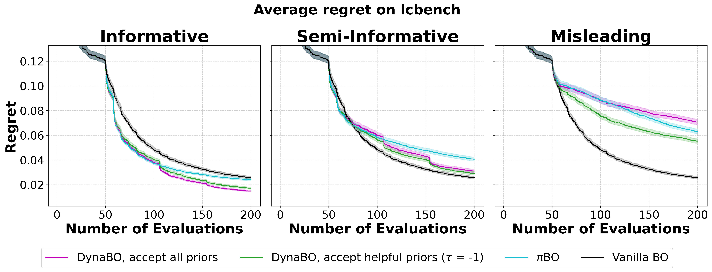

# DynaBO
This is the implementation of our ICLR 2025 submission titled **DynaBO: Dynamic Priors in Bayesian Optimization for Hyperparameter Optimization**. In the paper we propose a method to incorporate dynamic user feedback in the form of priors at runtime.



## Install
To install and run our method, you need to execute the following steps:
1. Clone the repository with all additional dependencies using:
```bash
git clone --recursive https://github.com/OrgName/DynaBO.git 
```
2. Create a `conda` environment and activate it using:
```bash
conda create -n DynaBO python=3.10
conda activate DynaBO
```
3. Install the repo and all dependencies:
```bash
make install
```

## Execution
Our experiments rely on the library. They therefore require either using a mysql database. The process of using PyExperimenter is described in its [documentation](https://github.com/tornede/py_experimenter).
To replicate our experiments you need to execute the following steps
1. Create gt_data needed for priors by running: ``dynabo/experiments/data_generation/execute_baseline.py`` for both ``mfbench`` and ``yahpogym``. 
2. Create priors by running ``dynabo/data_processing/extract_gt_priors.py``
3. Execute the baselines, dynabo, and πBO using the scripts located in ``dynabo/experiments``. In our experiments ran slurm jobs utilizing the scripts in ``cluster_scripts``.
4. Create plots using ``dynabo/plotting/plotting.py``.